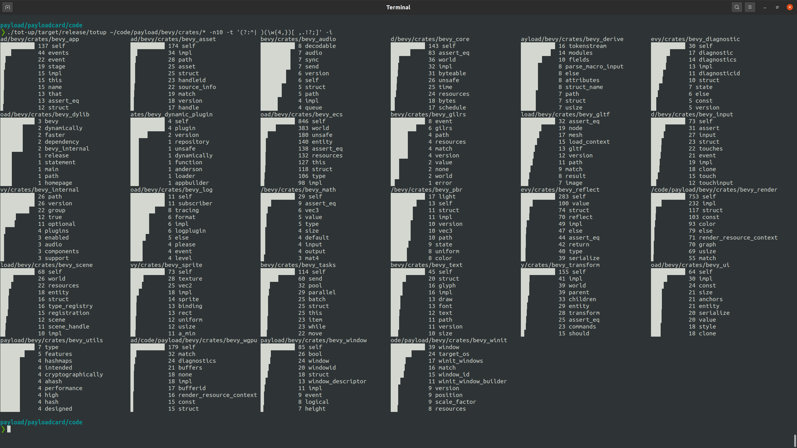

# tot up

So, you have bunch of texts in files and directories and subdirectories
and you don't know how many of which words are used in each of those.
totup goes through those files, counts distinct words and than just
tots it up for you.

⚠️ First rough version, CLI interface is wonky, breaks if you try.

